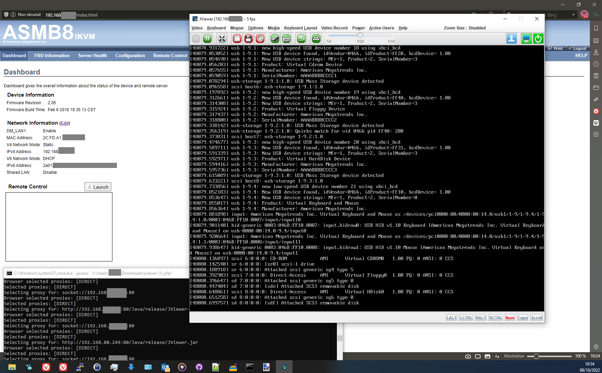
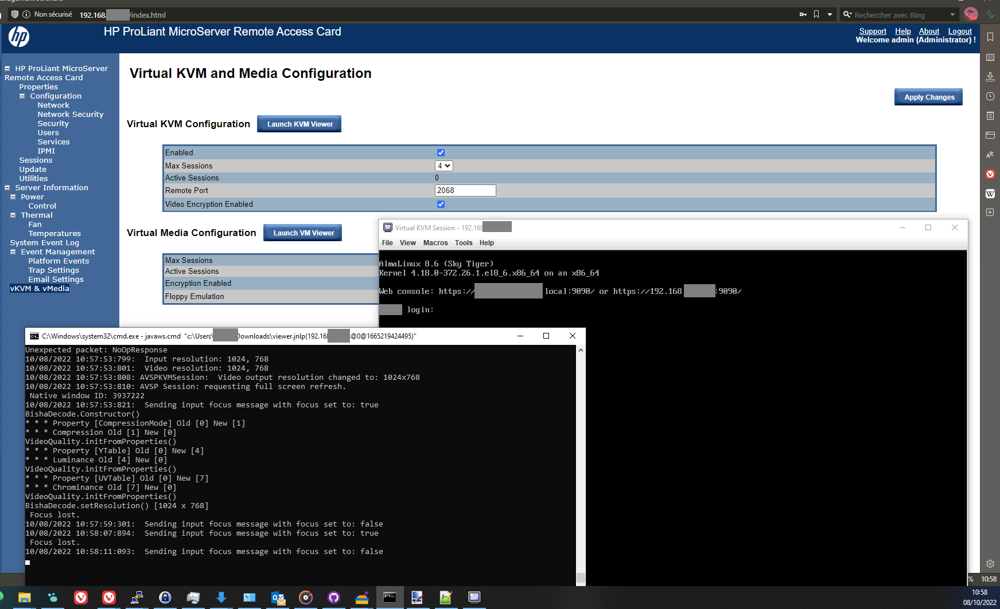

# IPMI / IMM / KVM / IRMC / IDRAC / ILO java starter

Most server hardware manufacturers have been using java for remote server access and video redirection.
The problem is that most elder servers without any updates work only with elder java versions, because of security issues (non trusted URLs, elder cihpers, elder security protocols, expired certificates).

This repo is a simple script that allows to use different java versions, and has a bundled (non Oracle) Java version which has been modified to allow weak security protocols and ciphers (SSL3.0, TLS1.0...).

The Java version also comes with java web starter (javaws) Iced-tea package, since that part wasn't made opensource by Oracle

# Usage

Unzip the archive you downloaded from the [release page](https://github.com/netinvent/ipmi-starter/releases), and launch javaws.cmd with the JNLP file you downloaded on the remote access page, eg:
```
javaws c:\Users\MyUser\Downloads\viewer.jnlp
```

# Example output




# What has been tested ?

| Remote Access implementation | Version    | Release year | JRE 1.6u45 | JRE 1.7u21 | JDK 1.8u352b01 |
|------------------------------|------------|--------------|------------|------------|----------------| 
| HP Proliant Gen7 RAC card    | FW 1.4     | 2013         | Yes        | Yes        | Yes            |
| ASUS P10S-I iKVM             | FW 2.05    | 2018         | Too old    | Yes        | Yes            |
| Fujitsu RX300 S7 IDRAC       | FW 6.65    | 2013         | Yes        | Yes        | Yes            |

# Known issues

- Some of the JNLP files contain a very short living password to connect to the remote console. You're supposed to launch the file as soon as you downloaded it. If you use a JNLP file later, you might face a "login failed" message because of the expired password.
- Most JNLP files should work with bundled JDK1.8 since it's security requirements are lowered, nevertheless, if you want to add your own JRE 1.6 versions:
   - JRE > 1.7u21 will not execute an app once it's certificate is expired, see (this post)[https://stackoverflow.com/a/33433821/2635443].
   - When downloading a non portable JRE (exe format), you can unzip it and use it as portable JRE. In order to do so, you'll need to unpack the jre\lib\*.pack files into jar files, see https://stackoverflow.com/a/25384578/2635443
      - In the root of the JRE directory, execute the following:
      - `for /r %x in (*.pack) do .\bin\unpack200.exe -r "%x" "%~dx%~px%~nx.jar"`

# Advanced usage

This repo comes with a bundled non oracle JDK and an opensource java webstart implementation.
You might want to add your own JREs. See the contents of `javaws.cmd` for help. JRE 1.6u45 and JRE 1.7u21 are already supported, but aren't shipped by default.
Once you unzipped those JREs in the imm-starter directory, you can adjust parameters in `javaws.cmd` file and then use JRE16 or JRE17 version variables like:
```
javaws c:\Users\MyUser\Downloads\viewer.jnlp jre17
javaws c:\Users\MyUser\Downloads\viewer.jnlp jre16
```

# Java security settings

The security settings are stored in `jre\lib\security\java.security` file.
The following variables have been adjusted in the bundled JDK
```
jdk.disabled.namedCurves = None
jdk.certpath.disabledAlgorithms=None
jdk.security.legacyAlgorithms=None
jdk.jar.disabledAlgorithms=None
jdk.tls.disabledAlgorithms=None
jdk.tls.legacyAlgorithms=None
```


# How about java applets on old equipments ?

Some equipment (example old hp procurve switches) use java applets that aren't supported anymore since java 1.7.
You'd basically need an old internet navigator that supports NPAPI plugin interface, bundled with an old java JRE to support those.

I've also investigated running those applets via **appletviewer** without much success.
Some java guru would be welcome to give some adivce about appletviewer.

A good alternative solution is to use a [java to html5 bridge](https://leaningtech.com/cheerpj-applet-runner/) that works with recent browsers, and allows to run those applets (although for the old hp procurve switches, it's really simpler to use CLI admin).

